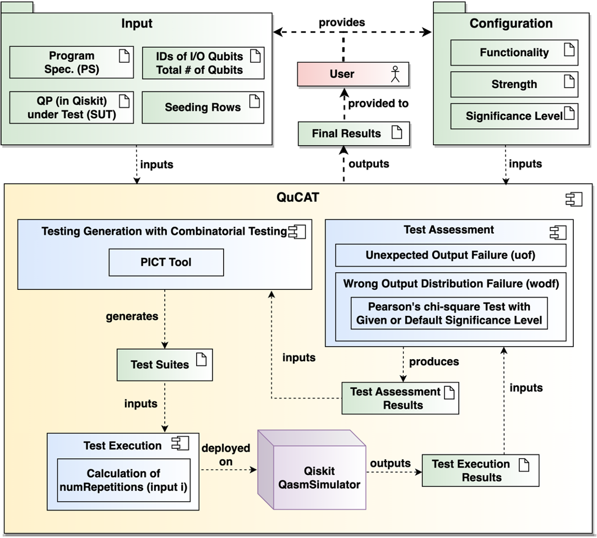

# QuCAT: A Combinatorial Testing Tool for Quantum Software


## Description
With the increased developments in quantum computing, the availability of systematic and automatic testing approaches for quantum programs is becoming more and more essential. To this end, we present the quantum software testing tool QuCAT for combinatorial testing of quantum programs. QuCAT provides two functionalities of use. With the first functionality, the tool generates a test suite of a given strength (e.g., pair-wise). With the second functionality, it generates test suites with increasing strength until a failure is triggered or a maximum strength is reached. QuCAT uses two test oracles to check the correctness of test outputs. We assess the cost and effectiveness of QuCAT with 3 faulty versions of 5 quantum programs. Results show that combinatorial test suites with a low strength can find faults with limited cost, while a higher strength performs better to trigger some difficult faults with relatively higher cost.
## Architecture of QuCAT


<!---
your comment goes here
and here


-->




## Installation

- Clone the current repository
  ```
  git clone https://github.com/qiqihannah/QuCAT-Tool.git
  ```
- Install R environment. You can download R for your OS from https://cran.r-project.org
- Install Anaconda. You can download Anaconda for your OS from https://www.anaconda.com/
- Install PICT. You can download PICT for your OS from https://github.com/Microsoft/pict
  - If you add it into system variable, you don't need to specify PICT root in the configuration file introduced later
<!---For example, for macOS
    ```
    wget https://repo.anaconda.com/archive/Anaconda3-5.3.1-MacOSX-x86_64.sh
    bash Anaconda3-5.3.1-MacOSX-x86_64.sh
    ```-->
- Create a conda environment (e.g., with name "qucat"):
   ```
   conda create -n qucat python=3.9
   ```
- Activate the environment and install Qiskit and rpy2
  ```
  conda activate qucat
  pip install qiskit
  pip install rpy2
  ```

## How to use QuCAT?
### Quantum Program File
- The quantum program should be written with Qiskit.
- The code has to be structured in a function named as 'run' with one parameter that refers to the quantum circuit.
- Users only need to add gates to the circuit and measure output qubits to get the output. They don't need to set any register, initialize circuits, choose the simulation, or execute the circuits in 'run' function.

A sample quantum program is available <a href="QR_Sample">here</a>.

### Configuration File
The configuration file should be written in an INI file.
The configuration file is described below.
```
[program]
root= 
;(Required)
;Description: The absolute root of your quantum program file.
num_qubit= 
;(Required)
;Description: The total number of qubit of your quantum program.
inputID= 
;(Required)
;Description: The IDs of input qubits.
;Format: A non-repeating sequence separated by commas.
outputID= 
;(Required)
;Description: The IDs of output qubits which are the qubits to be measured.
;Format: A non-repeating sequence separated by commas

[qucat_configuration]
pict_root=
;(Optional)
;Description: The absolute root to run pict. If the root is added to system variable, users don't need to specify it. pict_root='.' by default.
k=
;(Optional)
;Description: Order of combinations. In Functionality Two, it refers to the maximum value of strength. o = 2 by default. 
significance_level=
;(Optional)
;Description: The significance level for statistical test. significance_level = 0.01 by default.

[program_specification]
;Description: The program specification.
;Format:input string (binary),output string (binary)=probability
;Example:
;00,1=0.5
;00,0=0.5
;01,1=0.5
;01,0=0.5
;or
;0-,-=0.5
;Attention: '-' can refer to both '0' and '1'.
```
A sample configuration file is available <a href="QR_Sample"> here </a>.

First, you need to activate the conda environment:
   ```
   conda activate qucat
   ```

Second, you can start the program (from the repository root) as follows:
   ```
   python qucat.py
   ```
   
Third, you can enter a number to select your operation.
```
1. Check the template of the configuration file.(.ini file)

2. Check the example of the configuration file.(.ini file)

3. Upload your configuration.(.ini file)

4. Exit.
```

If you enter '3', QuCAT will guide you to enter the absolute root of your configuration(.ini) file.
```
please enter the root of your configuration file.(.ini file)
```
Then, you can enter 1 or 2 to specify the fundtionality:

```
1. Functionality One

1. Functionality Two
```
After that, you can choose whether to upload your seed row file. If you choose 'yes', QuCAT will guide you to enter the root.

```
"Please enter the root of your file.(.txt file)"
```

After all the preparation, QuCAT will generate test cases your requirement and execute to get results.

After running, you get 3 text files (2 in case there is no program specification). They contain
- Test Suites
- Test Outputs and Assessment Results
- Unit testing file of test suites

## Video Demonstration
A video demo is available <a href="https://youtu.be/UsqgOudKLio" target=_blank>here</a>.

## Experimental Data
Experimental data including quantum programs, and program specifications can be downloaded <a href="experiment_data">here</a>.

## Extension
One can checkout the code from GitHub and provide extensions to QuCAT.
